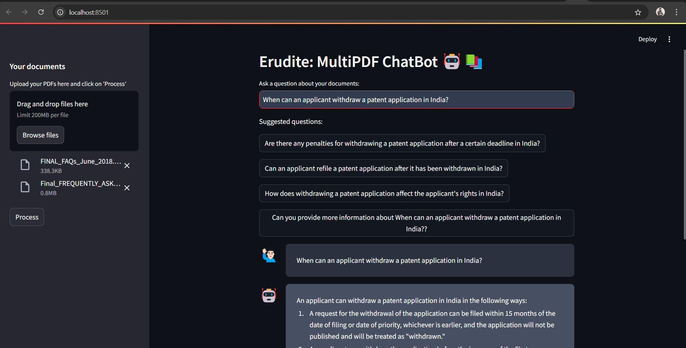
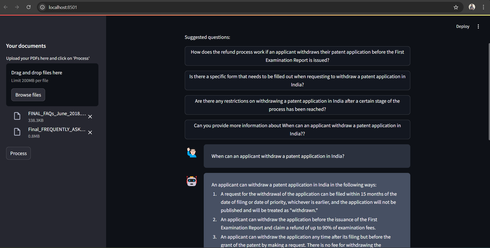

<h1 align="center">Erudite: MultiPDF ChatBot 🤖📚</h1>

Erudite says - Transform Your PDF Conversations!

 
         

## Introduction

Erudite is not just another chatbot, it's your intelligent assistant for navigating through multiple PDF documents. With Erudite, dive deep into your PDFs, extract relevant information, and have meaningful conversations about your documents. Powered by latest AI technologies, Erudite makes document interaction seamless and insightful.

## 🤖 Meet Erudite - Your MultiPDF Assistant

Erudite, your AI-powered PDF assistant, is designed to help you interact with multiple PDF documents effortlessly. Utilizing state-of-the-art Large Language Models and sophisticated text processing techniques, Erudite enables you to upload, analyze, and converse about your documents, providing accurate and contextually relevant answers.

## 📸 Image Gallery

## 🛠️ How It Works

1. **Document Upload**: Upload multiple PDF documents through our intuitive Streamlit interface.
2. **Text Extraction**: The `get_pdf_text()` function extracts text from the PDFs using PyPDF2.
3. **Text Chunking**: Text is divided into manageable chunks with `get_text_chunks()` for better analysis.
4. **Vectorization**: Create vector representations of text chunks with `get_vectorstore()` using OpenAI embeddings and store them in a FAISS index for swift retrieval.
5. **Conversation Chain**: The `get_conversation_chain()` function sets up a dynamic conversational retrieval chain featuring:
   - A custom prompt template
   - The ChatOpenAI language model
   - A conversation memory buffer
   - FAISS vector store for efficient document retrieval
6. **User Interaction**: Ask questions about your PDFs through the Streamlit interface.
7. **Answer Generation**: The `handle_userinput()` function processes queries, retrieves relevant information, and crafts responses using the conversation chain.
8. **Source Attribution**: Get source information with each response to trace back the data origins.

## 🌟 Features

- **Multi-PDF Uploads**: Seamlessly handle multiple PDFs 📄
- **Advanced Text Analysis**: Extract and analyze document content 🔍
- **Conversational Q&A**: Ask detailed questions and get precise answers 💬
- **Source Attribution**: Track the origins of information 📚
- **User-Friendly Interface**: Enjoy a smooth experience with our Streamlit app 🖥️

## 🧠 Technologies Used

- **Streamlit**: For creating an interactive user interface
- **LangChain**: For building the conversational AI pipeline
- **OpenAI**: For generating embeddings and powering the language model
- **ChatGroq**: For alternative language model
- **FAISS**: For fast similarity search and clustering of vectors
- **Hugging Face**: For open source embeddings and additional AI tools
- **PyPDF2**: For extracting text from PDFs
- **Alternative Tools**: Open source embeddings from HuggingFace, ChatGroq, Llama, Palm, NLTK etc.

## 🤝 Contributing

Contributions are welcome! Feel free to fork the repository, make improvements, and submit pull requests to enhance Erudite’s capabilities.

## 👨‍💻 About the Developer

Erudite is developed and maintained by [Pramod Koujalagi](https://github.com/pramodkoujalagi). Connect with me to provide feedback, suggestions, or ideas for future enhancements.

Elevate your PDF interactions with Erudite and experience a new level of document engagement! 🌟📚

## ⚖️ License

This project is licensed under the MIT License - see the [LICENSE](LICENSE) file for details.

---

Feel free to adjust any sections to better fit your needs or project specifics!
